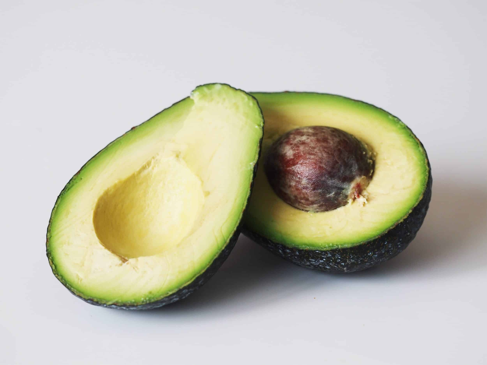

# Avocado-Price-Prediction

## What you'll learn
1. Problem Understanding.
2. Importing Libraries.
3. Importing Dataset into Dataframes.
4. Data Exploration.
5. Data Cleaning (Remove irrelevant columns, missing or incorrect values)
6. Converting Data formats into its correct format..
7. Analysing using Descriptive statistics methods.

## Intuition:
The aim of this project is to predict the prices of avocado which is a kind of fruit. The change in the prices is given in the dataset according to the date and other features. We have to analyse the dataset and find out the factors or trends which are affecting the prices of Avocado.

## Metadata:
The dataset includes the following features:

1. 'Date'		: Dates on the sale of Avocado
2. 'AveragePrice'	: The prices of Avocado
3. 'Total Volume'	: The total number of volume sold
4. '4046'		: Total number of avocados with PLU 4046 sold
5. '4225'		: Total number of avocados with PLU 4225 sold

